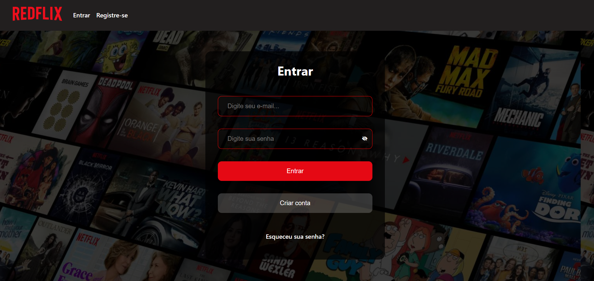

<h1 style="color:red;">🎬 RedFlix</h1>

O **RedFlix** é uma plataforma social (com estilo padrão netflix) com catálogo de filmes onde o usuário pode montar uma lista personalizada, comentar sobre filmes, e principalmente... **encontrar algo bom para assistir!** 🍿

## 🚀Tecnologias

### 🧩 Frontend

- HTML
- CSS
- React
- TypeScript
- Framer-Motion

### 🧠 Backend

- Node.Js
- Sequelize – ORM para banco de dados relacional
- JWT - Autenticação com tokens
- Padrão **MVC** – Estrutura de **Model**, **View** e **Controller**, seguindo princípios de **programação orientada a objetos**

## Funcionalidades

- Autenticação de usuário
- Rotas privadas com verificação via token
- Recuperação de Senha
- Cadastro de usuários
- Rotas Privadas
- Responsividade com detecção de dispositivo
- Filtro de filmes por gênero
- Busca de filmes
- Lista de favoritos dinâmica
- Comentários nos filmes
- Like e dislike nos comentários

## Como rodar localmente?

1. Clone o Repositório:

- git clone https://github.com/seu-usuario/redflix.git
- cd redflix

2. Instale as dependências

- npm install

3. Crie dois arquivos .env com os dados abaixo

### 🌐 Frontend (.env na raiz do frontend)

- VITE_REACT_APP_API_KEY=sua_chave_tmdb
- VITE_API_URL=https://seu-backend.up.railway.app

### 🛢️ Backend (.env na raiz do backend)

- DB_HOST=
- DB_USER=
- DB_PASSWORD=
- DB_NAME=
- JWT_SECRET=

---

## 👨‍💻 Autor

Esse projeto tem caráter de estudo e foi desenvolvido por [Alleson Sales](https://github.com/allesonsales).
Redes: [Linkedin](https://www.linkedin.com/in/allesonsales/) | [Portfólio](https://allesonsales.github.io/portfolio)
